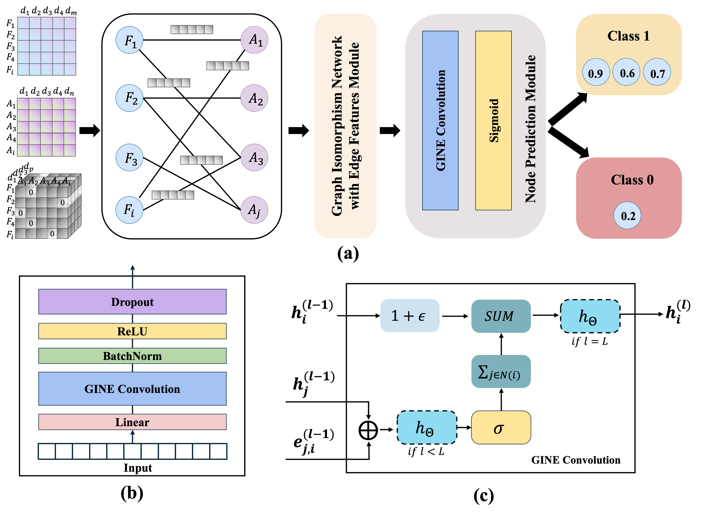

# ESPNet: Edge-Aware Graph Representation Learning over Analyst–Firm Bipartite Networks for Earnings Surprise Prediction
This repository provides the official implementation of our ICDM 2025 submission: ESPNet.  
ESPNet is a GINE-based graph neural network framework designed to predict earnings surprises by modeling analyst–firm interactions as a heterogeneous bipartite graph. The framework integrates edge-aware message passing and relational feature propagation to capture complex financial signals for robust prediction and downstream portfolio analysis.

## 🧠 Key Features

- Graph-based representation of firm–analyst networks
- Edge-aware message passing using GINE
- Two-stage earnings surprise classification tasks:
  - High vs. low ESP magnitude
  - Positive vs. negative directional surprise
- Long–short portfolio construction based on predicted signals
- Robust performance across evaluation metrics

---

## 📁 File Structure

| File / Folder               | Description |
|----------------------------|-------------|
| `edgegine_esm_class.py`    | Main implementation of the ESPNet model using GINE with edge features |
| `pytorchtools_update.py`   | Utility functions for training (e.g., early stopping) |
| `model.png`                | Visualization of the ESPNet architecture |
| `Results-Step1/`           | Intermediate model outputs and logs |
| `Results-Step2/`           | Final prediction results and portfolio evaluation |
| `README.md`                | This file |

---

## ⚙️ Dependencies

- Python ≥ 3.8  
- PyTorch ≥ 1.10  
- PyTorch Geometric ≥ 2.0  
- scikit-learn, pandas, numpy, tqdm  

